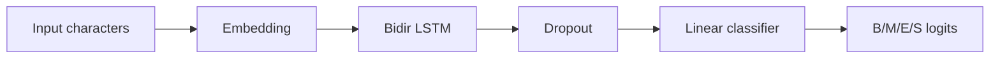
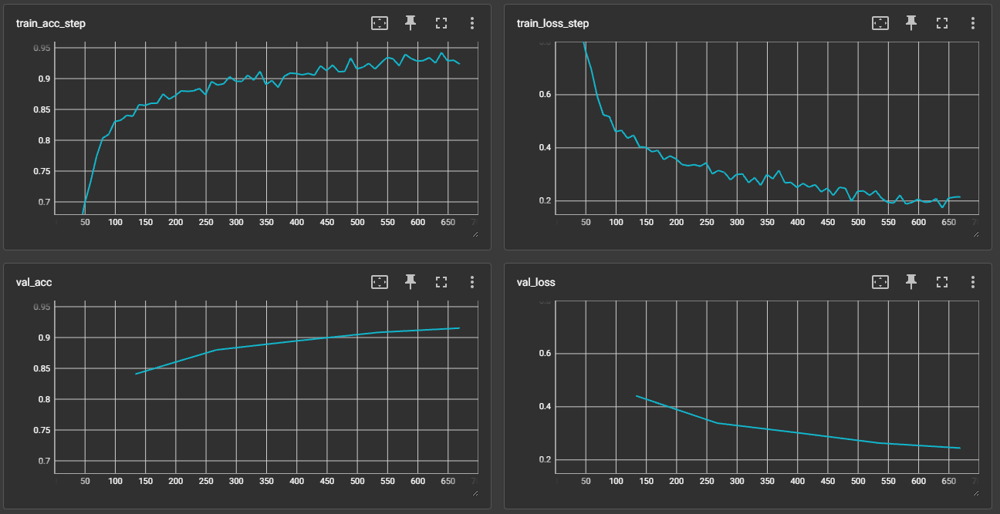

# 中文分词实验报告

胡诚成 2022213665

## 实验介绍

本项目实现两种中文分词方法：基于字典的最大匹配分词与基于双向长短期记忆网络（BiLSTM）的神经序列标注模型。数据使用 SIGHAN Bakeoff 的 icwb2 语料。

## 实验方法

### 数据预处理

- 使用 `data/icwb2-data/training/{corpus}_training.utf8` 作为带分词标注的训练数据，将每行的词序列转换为 B/M/E/S 标签序列。
- 构建字符词表，保留 `<pad>` 与 `<unk>`，其他字符按频率降序加入。
- 验证集从训练集划分 10%。

### 最大匹配分词

- 由训练集词表构建字典并统计最大词长 `L`。
- 前向与后向最大匹配得到两个分词序列，优先选择分词数更少、未登录词更少的结果，作为双向最大匹配输出。
- 通过 `cws-mmseg` 脚本对测试集进行分词，输出至 `output/{corpus}_mmseg.txt`。

### BiLSTM 分词模型

- 模型：嵌入层 + 双向 LSTM（hidden size 可配）+ 线性分类头输出 4 类标签（B/M/E/S）。
- 损失函数：掩码交叉熵
  $$\mathcal{L}=-\frac{1}{N}\sum_{i=1}^{N}\sum_{t=1}^{T_i}\log p(y_{i,t}\mid x_{i,t})\mathbf{1}_{y_{i,t}\neq\text{pad}}$$
- 评价指标：基于分词边界的 Precision/Recall/F1，使用跨度集合求交集。
- 训练使用 `cws-train`，Lightning 负责训练流程与 checkpoint；训练后可直接对测试集生成分词结果 `output/{corpus}_bilstm.txt`。
- 模型结构示意：



### 运行命令

- 最大匹配分词：

```bash
cws-mmseg --data-root . --corpus pku
```

- 训练并推理 BiLSTM：

```bash
cws-train --data-root . --corpus pku --epochs 5 --batch-size 128 --embedding-dim 128 --hidden-size 256
```

- 评估分词结果：

```bash
cws-eval output/pku_bilstm.txt data/icwb2-data/gold/pku_test_gold.utf8
```

## 实验结果

- 训练过程：BiLSTM 的训练/验证损失与准确率曲线：
 
- P/R/F1：。

| 方法     | P      | R      | F1     |
| -------- | ------ | ------ | ------ |
| 最大匹配 | 0.8876 | 0.7305 | 0.8014 |
| BiLSTM   | 0.8414 | 0.8498 | 0.8456 |

## 实验结论

- 在 pku 测试集上，BiLSTM 相比最大匹配将 F1 从 0.8014 提升到 0.8456，召回提升显著（0.7305→0.8498），说明上下文建模有效缓解了未登录词和歧义。
- 最大匹配依赖训练词典，对长未登录词切分偏碎；但其精度略高（0.8876），推理速度最快，适合作为轻量基线。
- BiLSTM 训练成本更高，但兼顾精度与召回，更适合对召回敏感的场景。可进一步尝试：在输出层加入 CRF、使用预训练字向量或 Transformer 编码、扩大词表并进行正则化，预计还能提升 F1。
